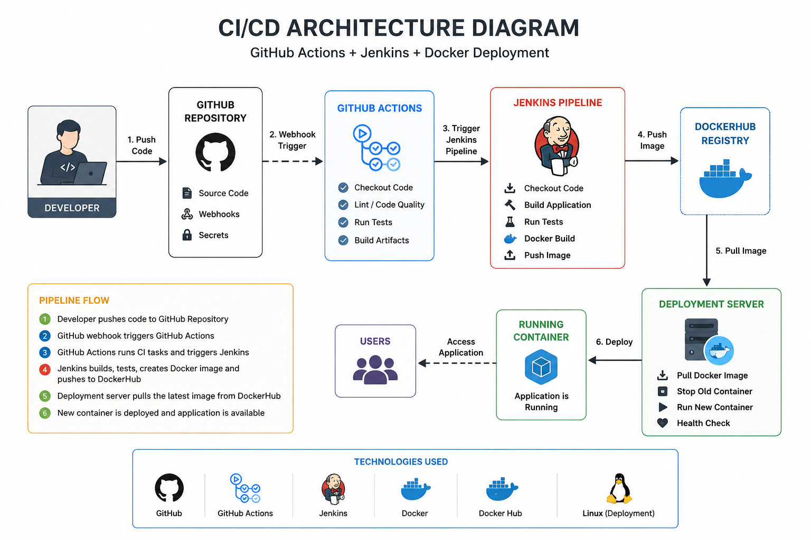

# CI/CD Pipeline Project

## Overview

This project demonstrates an end-to-end CI/CD pipeline using GitHub Actions, Jenkins, and Docker.

The pipeline automates:
- Source code integration
- Build and testing process
- Docker image creation
- DockerHub image publishing
- Automated application deployment

This project is designed to simulate a real-world DevOps workflow where every developer commit automatically triggers the CI/CD pipeline.

---

## Architecture

- GitHub for source code management
- GitHub Actions for CI workflow trigger
- Jenkins for pipeline orchestration
- Docker for containerization
- DockerHub for image registry
- Linux server for deployment

---

## Architecture Diagram



---

## Pipeline Workflow

1. Developer commits and pushes code to GitHub
2. GitHub webhook triggers GitHub Actions
3. GitHub Actions starts CI workflow
4. Jenkins pipeline gets triggered
5. Application build and tests are executed
6. Docker image is created
7. Docker image is pushed to DockerHub
8. Deployment server pulls latest Docker image
9. Old container is replaced with updated container
10. Updated application becomes available to users

---

## Technologies Used

| Technology | Purpose |
|---|---|
| GitHub | Source Code Management |
| GitHub Actions | Continuous Integration |
| Jenkins | Pipeline Automation |
| Docker | Containerization |
| DockerHub | Docker Image Registry |
| Linux | Deployment Environment |

---

## Repository Structure

```text
ci-cd-project/
│
├── .github/
│   └── workflows/
│       └── ci.yml
│
├── app/
│
├── Dockerfile
├── Jenkinsfile
├── docker-compose.yml
├── requirements.txt
├── architecture-diagram.png
└── README.md
```

---

## CI/CD Workflow

### Continuous Integration
- Automatic pipeline trigger on every code push
- Source code checkout
- Build validation
- Test execution
- Docker image build

### Continuous Deployment
- Push Docker image to DockerHub
- Pull latest image on deployment server
- Stop old running container
- Deploy updated application container

---

## Pipeline Testing

To test the CI/CD pipeline:

1. Make changes to the application or README
2. Commit the changes
3. Push code to GitHub repository

Example:

```bash
git add .
git commit -m "Test CI/CD pipeline trigger"
git push origin main
```

After pushing code:
- GitHub Actions workflow starts automatically
- Jenkins pipeline gets triggered
- Docker image is rebuilt
- Latest image is pushed to DockerHub
- Deployment process starts automatically

---

## Docker Commands Used

### Build Docker Image

```bash
docker build -t your-image-name .
```

### Run Docker Container

```bash
docker run -d -p 8080:8080 your-image-name
```

### Push Docker Image

```bash
docker push your-dockerhub-username/your-image-name
```

---

## Jenkins Pipeline Stages

- Checkout Code
- Build Application
- Run Tests
- Build Docker Image
- Push Docker Image
- Deploy Application

---

## Future Enhancements

- Kubernetes deployment
- Helm chart integration
- ArgoCD GitOps implementation
- Monitoring with Prometheus and Grafana
- Automated rollback strategy
- Multi-environment deployment
- Security scanning integration

---

## Design Decisions

### Why Docker before Kubernetes?

This project focuses on mastering CI/CD fundamentals and container lifecycle management before moving to orchestration platforms like Kubernetes.

### Why Jenkins with GitHub Actions?

GitHub Actions provides repository-native CI automation while Jenkins simulates enterprise-level pipeline orchestration commonly used in production environments.

---

## Project Objective

This project demonstrates practical DevOps skills including:
- CI/CD automation
- Docker containerization
- Pipeline orchestration
- Automated deployment
- Docker image lifecycle management
- Infrastructure workflow understanding

- ## Monitoring & Observability

Integrated Prometheus, Grafana, and Alertmanager using kube-prometheus-stack.

### Features

- Cluster Monitoring
- Pod Monitoring
- CPU & Memory Tracking
- Alerting
- Self-Healing Validation

### Validation Performed

- Successful Kubernetes Deployment
- Prometheus Metrics Collection
- Grafana Dashboard Verification
- Pod Recovery Testing

### Monitoring Dashboard


---

## Author

Sujith Kumar S
